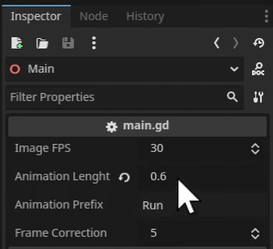

# 2D Sprite Generator from 3D Models 

This is a simple Godot 4.4 project that lets you convert animated 3D characters into 2D sprites by automatically capturing each frame of an animation and saving it as PNG images.

---

## ✨ Features

- Easy setup for 3D to 2D sprite conversion  
- Automatically captures animation frames and exports PNGs  
- Customizable frame rate, animation length, and naming  

---

## 🚀 Getting Started

### 1. Setup the Project

- Place your **animated 3D character** in the scene.  
- Setup **lights** for your scene.  
- Optionally, use the included **outline shader** (you can disable or adjust it via the Inspector).  
- In the **AnimationPlayer**, set your desired animation to **"Run on Start"** (click the `A` icon).  

- Copy the **animation duration** (you’ll need it later).

---

### 2. Adjust Parameters

Click the main node in the scene and modify the following in the **Inspector**:

- **Image FPS** – Frames captured per second (keep this consistent with your animation FPS).  
- **Animation Length** – Set this to your animation duration (in seconds).  
- **Animation Prefix** – Adds a prefix to each PNG filename to help identify animations.  
- **Frame Correction** – Adds extra frames at the end (default is 5). Useful for better looping. *(This may be removed in the future)*

---

### 3. Run the Project

- Hit **Play** in the editor.  
- The animation will play, and once it's finished, the capture will stop.  
- A folder will automatically open with all the captured **PNG sprites**.  
- Use them in your 2D games or animations!

---

## 📝 Notes & Tips

- You can improve PNG quality by increasing the **window size** in **Project Settings** and scaling your scene accordingly.  
- For large movement animations (e.g., jumping), animate the **camera** to follow or fit the motion.  
- If your sprite loop doesn't look right, try adjusting the **Frame Correction** value.  
- As a known bug, the first frame (`000.png`) is empty — just delete it.

---

## 📦 Credits

For demonstration purposes, this project uses some awesome third-party assets:

- **Outline Shader**  
  [Thick 3D Screen-Space Outline Shader](https://godotshaders.com/shader/thick-3d-screen-space-depth-normal-based-outline-shader/)

- **Gobot Character**  
  [Gobot from GDQuest Demos](https://github.com/gdquest-demos/godot-4-3D-Characters/tree/main?tab=readme-ov-file)
